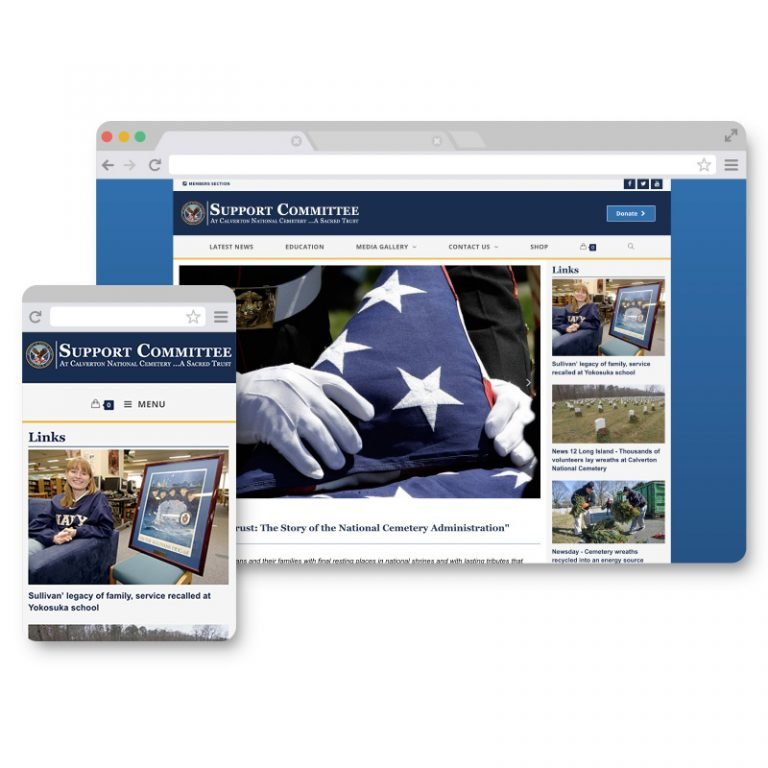

# Projects
---

<a href="/projects/m10-website.html">

Mark-10 - website redesign
</a>

<a href="/projects/sepa.html">

SEPA Symposium
</a>

<a href="/projects/scacnc.html">

SCACNC
</a>

<a href="/projects/idjnow.html">

Motion Graphics - IDJNOW
</a>

<a href="/projects/farmhousebnb.html">

The Farmhouse Bed and Breakfast
</a>

<a href="/projects/tbr-datavis.html">

TBR News Media - Data Visualization
</a>

<a href="/projects/tbr-businesshighlights.html">

TBR News Media – Business Highlights
</a>

# About
---
David Ackerman is a graphic designer and web developer located in NY.